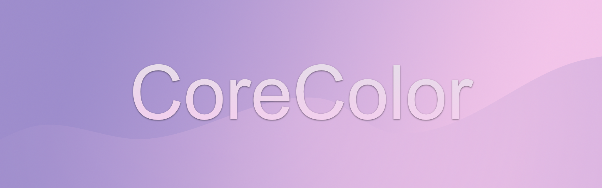

## Color modeling and conversion framework in Swift


[](https://github.com/yukonblue/CoreColor/actions/workflows/swift.yml)
[](https://swiftpackageindex.com/yukonblue/CoreColor)
[](https://swiftpackageindex.com/yukonblue/CoreColor)


## Overview

*CoreColor* is a color modeling and conversion framework written in Swift.
It is designed for a wide range of audience, including color enthusiasts,
engineers, visual designers and artists, as well as those involved in
scientific researches that rely on color modeling.

*CoreColor* provides the modeling for a variety of common color models
and associated color spaces, including common ones such as
RGB, CMYK, HSL, HSV, LAB, and XYZ, as well as facilities
for converting between a particular color model to any of the other ones.


## Usage

The interfaces of *CoreColor* are simple and intuitive to use.
Here's an example of creating an instance of RGB color model
in sRGB color space, and convert it to the equivalent CMYK model.

```swift
import CoreColor

let rgb = RGB(r: 0.40, g: 0.50, b: 0.60, alpha: 1.0, space: RGBColorSpaces.sRGB)
print(rgb) // RGB(r: 0.4, g: 0.5, b: 0.6, alpha: 1.0, space: CoreColor.RGBColorSpace(...))

let cmyk = rgb.toCMYK()
print(cmyk) // CMYK(c: 0.3333334, m: 0.1666667, y: 0.0, k: 0.39999998, alpha: 1.0)
```


## Details

### Color Models

The following color models are currently supported:

- RGB (various RGB color spaces)
- XYZ (CIE XYZ)
- LUV (CIE 1976 `L*u*v*`)
- LAB (CIE 1976 `L*a*b*`)
- CMYK
- HSV
- HSL

### RGB Color Space

The following variations of RGB color spaces are currently supported:

- sRGB
- Linear sRGB
- Adobe RGB
- Display P3

### Precision and Accuracy

*CoreColor* was designed to be sufficiently precise in its color modeling,
as well as accurate in all color space conversions.

All color model representations are based on 32-bit floating-point values.
This achieves sufficient precision and accuracy for the intended audience.

There is plan to extend the precision to beyond 32-bit floating
points, as well as using integer representations for select color models in
the future.


## License

*CoreColor* is licensed under the [MIT License](https://choosealicense.com/licenses/mit/).


## Credits

*CoreColor* is a project of [@yukonblue](https://github.com/yukonblue).
